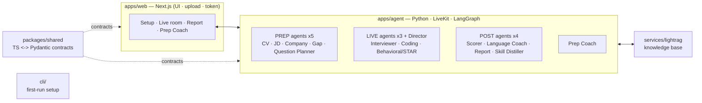

<div align="center">


# DeepInterview: Voice-First, Multilingual AI Mock Interviewer

### Practice the interview out loud. Then pass the real one. · Multi-agent · Open source

[](LICENSE)
[](https://github.com/ngoanpv/DeepInterview/actions)
[](https://github.com/ngoanpv/DeepInterview/releases)
[](https://github.com/ngoanpv/DeepInterview/stargazers)
[](apps/agent)
[](pnpm-workspace.yaml)
[](https://discord.gg/fT7Ecbyq)
[](CONTRIBUTING.md)

**UI in English + Tiếng Việt · voice interviews in 7 languages incl. Vietnamese (more as packs land) · no sign-in required to self-host**

[Quickstart](#quickstart) · [Why](#why-deepinterview) · [Features](#features) · [Architecture](#architecture) · [Community](#community) · [Contributing](#contributing)

**Contributions wanted** — [interview question-bank packs](https://github.com/ngoanpv/DeepInterview/issues/38) · [language packs & provider adapters](docs/GOOD_FIRST_ISSUES.md) · your packs get asked in real interviews, and no API keys are needed to develop.

</div>

---

<!-- HERO: live voice interview → scored report, recorded from the real app. -->


> **Upload your CV and a job description. Talk to an AI interviewer. Get scored — and coached on exactly what you missed.** Voice-first, English-first, and multilingual by design.

DeepInterview closes the **prep ⇄ interview ⇄ feedback** loop: heavy reasoning runs *before* the call (read your CV + the JD, research the company, build an adaptive question plan), a lean real-time voice loop runs the interview, then strong models score it and route you into a study coach for your weak areas.

> **Honest status:** this is an **early open build**. The contracts, prep/live/post pipelines, web screens, and CLI are implemented and **run offline with mock adapters** (no API keys, tests green). Real-time voice, web research, and video avatars need provider keys. `docker compose up` brings up the full base stack (web + agent API + knowledge sidecar, healthy with zero keys); the live voice worker runs via `docker compose --profile live up` once LiveKit keys are set. We mark what's done honestly, per feature, throughout this README.

## Quickstart

> **No sign-in required.** The OSS self-host runs **anonymously** — setup, the live interview, and the report all work with **no account and no login**. (The report reads directly from the agent API.) Supabase auth + billing are a **hosted-only** layer; you don't need them to run the loop yourself.
>
> **Zero-upload demo:** the `/setup` screen has a one-click **Quick demo** that fills a sample CV + JD, so you can try the whole loop without uploading anything.

**Requirements:** Node **20+** (22 recommended — see [`.nvmrc`](.nvmrc)) · pnpm 11 · Python 3.11+ with [uv](https://docs.astral.sh/uv/) (for the agent) · Docker (for the full stack).

### 1. Offline path (verified — no API keys needed)

This is what's tested in CI today. It builds the contracts, runs the test suites, and exercises the prep/live/post pipelines against **mock adapters** — no provider keys required.

```bash
git clone https://github.com/ngoanpv/DeepInterview.git
cd DeepInterview

pnpm install          # install the JS/TS workspace
pnpm build            # build packages/shared (contracts) + cli + web
pnpm test             # TS + Pydantic parity + pipeline tests (offline, mock adapters)

pnpm deepinterview init   # scaffold .env from .env.example (fill in keys later)
```

> `pnpm build` must run before `pnpm deepinterview init` — the CLI is built into `cli/dist/`.
> For the Python agent: `uv --directory apps/agent sync` then `uv --directory apps/agent run pytest`.

### 2. Full-stack path (`docker compose up` — verified)

```bash
pnpm deepinterview init    # or: cp .env.example .env  (keys are optional — see note)
docker compose up --build  # web (:3000) + agent API (:8000) + lightrag (:9621)
```

> **Status (verified July 2026, Docker 29 / Compose v5):** all images build and the three base services come up **healthy with zero keys** — the agent runs the full prep → plan → score loop on mock adapters, and http://localhost:3000 works offline.
>
> - **Docker reads the repo-root `.env`** (compose `env_file`). Local dev (`pnpm dev`) instead reads `apps/agent/.env` and `apps/web/.env.local` — keys there are **not** visible to the containers, so put them in the root `.env` for Docker.
> - The **live voice worker** is opt-in: `docker compose --profile live up`. It **requires** `LIVEKIT_URL` / `LIVEKIT_API_KEY` / `LIVEKIT_API_SECRET` (plus STT/TTS/LLM keys) in the root `.env`; without them the worker exits and restart-loops while the base stack keeps running.

### 3. One-click deploy

[](https://vercel.com/new/clone?repository-url=https://github.com/ngoanpv/DeepInterview)

The button deploys **`apps/web`** to Vercel. The Python **agent** is not serverless — run it via **Docker** (the `agent-api` image above) or on **[LiveKit Cloud Agents](https://docs.livekit.io/agents/)** for the live voice worker, and point the web app at it with `AGENT_API_URL`. See [`docs/DEPLOY.md`](docs/DEPLOY.md) (WP-12, in progress).

<details><summary>Configuring providers & adding a language pack</summary>

- **Keys** live in `.env` only (never committed). See [`.env.example`](.env.example) for the full list (LiveKit, Supabase, R2, STT/TTS/LLM, Tavily/Exa, observability).
- **Provider choice** is per-component: set `STT_PROVIDER`, `TTS_PROVIDER`, `LLM_PROVIDER` and the matching key. With no keys set, the agent falls back to **mock adapters** so everything still runs offline.
- **Languages** are pluggable packs. UI strings live in `apps/web/lib/i18n/messages/` (EN + VI shipped); each planned question's `text` is a `LocalizedText` map (`text.en` / `text.vi` / …) alongside a `language_mode`.

See [CONTRIBUTING.md](CONTRIBUTING.md) for the full dev setup and the provider-adapter pattern.

</details>

## Why DeepInterview

Practicing in your head (or in a text chat) isn't how interviews work. DeepInterview is **voice-first** — you answer out loud, in real time, like the real thing — and built to be **owned, not rented**:

- **A real conversation, not a form** — a cascaded **STT → LLM → TTS** loop on LiveKit with barge-in, semantic end-of-turn detection, and adaptive follow-ups, so the interviewer reacts to *what you actually said*.
- **Prepared like a real interviewer** — before the call it reads your CV + the JD, researches the company, and precomputes a personalized question plan with rubrics; the live loop stays fast because the thinking already happened.
- **Feedback you can act on** — per-competency rubric scores, model answers, and a study coach that targets exactly the gaps the interview exposed (a closed prep ⇄ interview ⇄ feedback loop).
- **Multilingual by design** — UI in EN+VI, voice interviews in 7 languages including Vietnamese; STT/TTS route by language automatically, and each language is a pluggable pack.
- **Yours end to end** — Apache 2.0, fully self-hostable, **bring-your-own keys** for every provider — or **run every model locally** (Ollama + Whisper + Kokoro, [docs/LOCAL_MODELS.md](docs/LOCAL_MODELS.md)) — and **no sign-in required**: no account, no login, no data leaving your box unless you choose a provider.

## Features

- **Personalized prep** — a LangGraph pipeline reads your CV + the JD, researches the target company, diffs the gap, and a **Question Planner** precomputes the plan, difficulty curve, rubrics, and seeded follow-ups — so the live loop stays fast. Uploaded **CV documents (PDF/DOCX) are parsed to text server-side with [Microsoft markitdown](https://github.com/microsoft/markitdown), with a Gemini multimodal fallback for scanned/image PDFs**.
- **Community playbook library** — question-bank packs in [`skills/`](skills/) (versioned Markdown + YAML) are retrieved by role/level and injected into the Question Planner: packs the community writes get asked in real interviews. Validate yours with `pnpm deepinterview skills lint`.
- **Scored feedback** — a rubric-based evaluator + language coach write a per-competency `ScoreCard` with strengths, gaps, model answers, and next steps that map straight back to the questions you were asked.
- **Prep Coach** *(in progress)* — turns your gaps into an LLM study loop (plan → drills → Socratic chat). Grounded + cited answers are **optional**: set `LIGHTRAG_URL` (or wire a managed RAG behind the same adapter) to ground responses in your own uploaded materials; by default the coach answers honestly without fabricated citations.
- **Cost-smart avatars** *(in progress)* — the crossfade system + persona fallbacks are built; pre-rendered idle/speaking loops from **any video generator** drop in as packs land ([docs/AVATARS.md](docs/AVATARS.md) — until then it renders a calm gradient stage). Original personas only (no named IP), so runtime cost is **CDN-only — no per-minute avatar fees**.

## Provider matrix

**Every stage is swappable — bring your own vendor.** The live voice loop is **cascaded STT → LLM → TTS** over LiveKit; you pick each vendor with a single env var (`STT_PROVIDER` / `TTS_PROVIDER` / `LLM_PROVIDER`) plus its key. No code changes, no vendor lock-in — providers sit behind a clean adapter interface, and adding a new one is a small PR (see [CONTRIBUTING.md](CONTRIBUTING.md)). With no keys set, every stage falls back to an offline **mock adapter** so the full loop runs in CI and on day-one clones.

| Stage | Choose with | Cloud vendors (pick one) | Fully local | No key set |
|---|---|---|---|---|
| **STT** | `STT_PROVIDER` | **Deepgram nova-3** (default) · Soniox | **`whisper`** · **`qwen3-asr`** — any OpenAI-compatible server | mock adapter |
| **TTS** | `TTS_PROVIDER` | **Cartesia sonic** (default) · ElevenLabs Flash v2.5 · Gemini TTS | **`kokoro`** — kokoro-fastapi | mock adapter |
| **LLM** | `LLM_PROVIDER` | **Gemini live tier** (default) · OpenAI | **`ollama`** — e.g. Qwen3 | mock adapter |

### Run it 100% local

```bash
pnpm deepinterview init      # choose "100% local models"
```

Sets `LLM_PROVIDER=ollama`, `STT_PROVIDER=whisper`, `TTS_PROVIDER=kokoro` — every
model runs on your machine, no LLM/STT/TTS keys, and nothing about your CV leaves
your box. Verified end to end on Apple Silicon with `qwen3:8b`: a CV-grounded
question plan in ~2 minutes, then a **live voice interview with a real
microphone** through to a scored report.

Two honest caveats: **LiveKit is still the real-time transport** (use LiveKit
Cloud, or `livekit-server --dev` for a fully offline stack), and local STT is
batch, so captions appear per utterance rather than word by word. Turn latency
on local models is not benchmarked, and Kokoro has no Vietnamese voice.
Full setup, hardware notes and troubleshooting: **[docs/LOCAL_MODELS.md](docs/LOCAL_MODELS.md)**.

> **Language routing is automatic — not something you configure.** If your chosen TTS doesn't cover the session language (e.g., Vietnamese on Cartesia), the agent reroutes that session to ElevenLabs or Gemini TTS when a key is present. Cartesia covers en, es, zh, fr, de, ja, pt, hi, it, ko, nl, pl, ru, sv, tr; Deepgram nova-3 covers English + many languages (Vietnamese validation in progress).

## News

> - **[2026.08]** **Run the whole thing on your own machine.** The LLM, speech-to-text and text-to-speech stages now point at local OpenAI-compatible servers — **Ollama**, a local **Whisper** server and **Kokoro** — so an interview needs no model keys at all. Verified end to end on Apple Silicon; pair it with `livekit-server --dev` for a fully offline stack. English voices for now, and turn latency isn't benchmarked. See [docs/LOCAL_MODELS.md](docs/LOCAL_MODELS.md).
> - **[2026.07]** **Now on Gemini 3.6 Flash + LiveKit Agents 1.6.** Prep and scoring run on **Gemini 3.6 Flash**; the live voice stack moved to livekit-agents 1.6 (Gemini 3-ready function calling on the turn path), and live captions now read as one paragraph per speaker instead of per-fragment lines.
> - **[2026.07]** **The open-source build is fully uncapped — billing removed.** Self-host with your own keys: no plan gates, no interview caps, no billing tables. Payments live only in the hosted edition; the OSS schema got leaner.
> - **[2026.07]** **Hardening release.** Opt-in shared-secret auth for the agent API and knowledge sidecar, locked-down Supabase row policies, and periodic transcript checkpointing so a killed process loses seconds of your interview, not all of it.
> - **[2026.07]** **The study coach now grounds answers in *your* session.** Prep ingests your CV, the JD, and company research into the knowledge sidecar keyed by session — coach answers cite your own materials, not generic tips.
> - **[2026.06]** **Live voice interviews run on real providers.** The full loop — personalized prep (real Gemini CV/JD analysis + company research) → real-time voice interview on LiveKit (Deepgram STT · Gemini · Cartesia/ElevenLabs TTS) → scored report — now runs end to end, with semantic end-of-turn detection and noise-robust, word-gated barge-in.
> - **[next]** A hosted live demo, and more language packs.

_(Honest by policy — no shipped-feature claims until they're true. Older entries roll into [CHANGELOG.md](CHANGELOG.md).)_

## Releases

Current release: **[v0.3.0](https://github.com/ngoanpv/DeepInterview/releases/tag/v0.3.0)** (2026-08-02) — a fully local model path (Ollama + Whisper + Kokoro) so an interview needs no model keys at all, on top of the v0.2.0 loop: prep → live voice interview → scoring → coach verified on real providers, uncapped billing-free OSS build, hardened API surface, and the community playbook library wired into the question planner. See [Releases](https://github.com/ngoanpv/DeepInterview/releases) for notes; citation metadata lives in [`CITATION.cff`](CITATION.cff).

## Architecture

The spine of the system is a **prep / live / post** split (strong async models before and after the call; one lean fast model on the live turn path). All three phases thread a single shared `InterviewContext` "blackboard" — written in prep, read+appended in live, read in post.

**Overview — agents & repo design:**



**Module boundaries:** `apps/web` owns UI/auth/upload/token and knows nothing about LLM/STT/TTS · `apps/agent` owns the voice loop + prep/post pipelines + avatar render util · `services/lightrag` owns the knowledge base · `cli/` owns first-run setup · **`packages/shared` is the cross-language contract** (TS source of truth, mirrored as Pydantic).

Full request-flow diagrams and the multi-agent design live in [`docs/ARCHITECTURE.md`](docs/ARCHITECTURE.md).

## Using DeepInterview

| Edition | What you get | Auth & billing | Status |
|---|---|---|---|
| **Self-host (Apache 2.0)** | The whole platform, your keys, your data. Runs **anonymously** — no sign-in. | None required | ✅ Available now (this repo) |
| **Cloud (hosted)** | Managed hosting with accounts + plan tiers, so you skip the ops. | Supabase auth + billing | 🟡 Planned (pre-launch) |

> The **auth + billing layer is hosted-only** — the open-source self-host runs the full prep → interview → report → coach loop without any account.

## Community

- **[Discord](https://discord.gg/fT7Ecbyq)** — join the build-in-public chat.
- **[GitHub Discussions](https://github.com/ngoanpv/DeepInterview/discussions)** — questions, ideas, language-pack and playbook requests.
- **[Issues](https://github.com/ngoanpv/DeepInterview/issues)** — bugs & features (templates provided).
- **[The playbook library](skills/README.md)** — browsable interview question-bank packs that directly shape the AI's questions; contributions welcome ([#38](https://github.com/ngoanpv/DeepInterview/issues/38)).

Built in the open, with [Claude Code](https://claude.com/claude-code) as a heavily-used co-author — the AI interviewer declined to interview it. We respond to issues — ghosting contributors is the #1 cause of OSS death, and we don't intend to.

**Standing on other people's shoulders.** The local path is built on
[LiveKit Agents](https://github.com/livekit/agents),
[Ollama](https://github.com/ollama/ollama),
[Kokoro-82M](https://huggingface.co/hexgrad/Kokoro-82M) and
[faster-whisper](https://github.com/SYSTRAN/faster-whisper). If you want a pure
local *voice pipeline* rather than a full interview platform, go look at
[**@huggingface**'s `speech-to-speech`](https://github.com/huggingface/speech-to-speech)
(Apache-2.0) — the same cascaded VAD → STT → LLM → TTS philosophy we use, with
MLX on Apple Silicon and an OpenAI Realtime-compatible API. It's the closest
sibling to this project's local mode and the best place to start if you're
assembling your own.

## Contributing

We'd love your help — especially **interview question-bank packs** ([#38](https://github.com/ngoanpv/DeepInterview/issues/38)), **language packs**, **provider adapters**, and **accessibility**. Start with:

- [CONTRIBUTING.md](CONTRIBUTING.md) — dev setup, the monorepo map, the work-package model, the provider-adapter (mock-first) pattern, and how to run **offline with no keys**.
- [Good first issues](docs/GOOD_FIRST_ISSUES.md) — concrete, scoped tasks drawn from real gaps.
- [Code of Conduct](CODE_OF_CONDUCT.md) · [Security policy](SECURITY.md).

[](https://github.com/ngoanpv/DeepInterview/graphs/contributors)

## Citation

If DeepInterview helps your work, please cite it. Full metadata is in [`CITATION.cff`](CITATION.cff).

```bibtex
@software{deepinterview2026,
  title  = {DeepInterview: Voice-First, Multilingual AI Mock Interviewer},
  author = {The DeepInterview contributors},
  year   = {2026},
  license = {Apache-2.0},
  url    = {https://github.com/ngoanpv/DeepInterview}
}
```

---

<div align="center">

**License:** [Apache-2.0](LICENSE) · Built in the open

[back to top](#deepinterview-voice-first-multilingual-ai-mock-interviewer)

</div>
